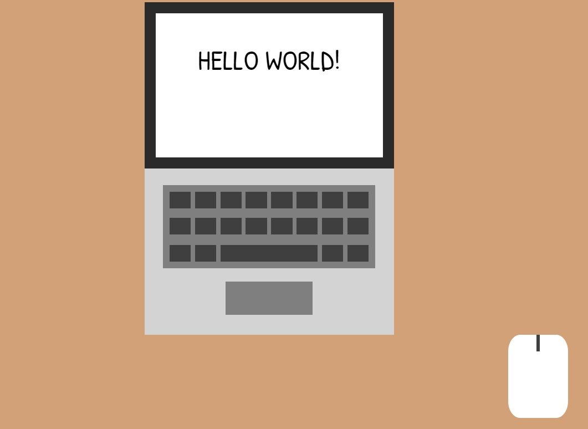

# Pure CSS Challenge: Day 1 > Image 2

*May 7, 2018* | After seeing this image (https://github.com/cyanharlow/purecss-francine) go viral on Twitter I decided to spend sometime practicing my own CSS skills. Part of a monthly goal to create one pure CSS image a day for the remainder of May 2018

## Other Pure CSS Images

* https://github.com/pennmeg/pure_css_desk-flatlay
* https://github.com/pennmeg/pure_css_pixel_heart
* https://github.com/pennmeg/pure_css_image
* https://github.com/pennmeg/pure_css_pug
* https://github.com/pennmeg/pure_css_tayles
* https://github.com/pennmeg/pure_css_cat
* https://github.com/pennmeg/pure_css_duck
* https://github.com/pennmeg/pure_css_ocanada
* https://github.com/pennmeg/pure_css_corgi
* https://github.com/pennmeg/pure_css_space_giraffe
